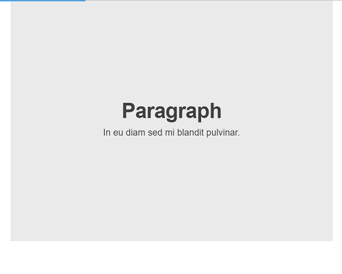

# bespoke.js - Slide Show (S9) Template Pack

## Live Preview



See [`slides.html`](http://slideshow-templates.github.io/slideshow-bespoke.js/slides.html).

For testing see
[`test.html`](http://slideshow-templates.github.io/slideshow-bespoke.js/test.html) and
[`test.minimal.html`](http://slideshow-templates.github.io/slideshow-bespoke.js/test.minimal.html).


## What's Slide Show (S9)?

A Ruby gem that lets you create slide shows and author slides in plain text
using a wiki-style markup language that's easy-to-write and easy-to-read.
More [Slide Show (S9) Project Site »](http://slideshow-s9.github.io)

## Intro

The [bespoke.js](https://github.com/bespokejs/bespoke) package
by Mark Dalgleish et al bundled up into
a Slide Show (S9) template pack.

Note, the bespoke.js template pack is configured to use
the following headers in `slides.html`:

    author: Your Name Here
    title: Your Slide Show Title Here


## Try It Yourself - How To Use the bespoke.js Template Pack

If you want to try it yourself, install (fetch) the new template pack. Issue the command:

    $ slideshow install bespoke.js

Or as an alternative clone the template pack using `git`. Issue the commands:

    $ cd ~/.slideshow/templates
    $ git clone https://github.com/slideshow-templates/slideshow-bespoke.js.git

To check if the new template got installed, use the `list` command:

    $ slideshow list

Listing something like:

    Installed templates include:
       bespoke.js (~/.slideshow/templates/bespoke.js/bespoke.js.txt)


Now you're ready to use it using the `-t/--template` switch. Example:

    $ slideshow build sample.md -t bespoke.js

That's it.


## Build / Update Notes

Uses npm (node package manager) to fetch bespoke modules (incl. themes).
E.g. to install use:

    $ npm install bespoke --save

For now the added bespoke plugins include:

- `bespoke-keys`
- `bespoke-touch`
- `bespoke-bullets`
- `bespoke-scale`
- `bespoke-progress`
- `bespoke-backdrop`

E.g. to install use:

    $ npm install bespoke-keys bespoke-touch bespoke-bullets ... --save

And the added bespoke theme used is `bespoke-theme-cube`. E.g. to install use:

    $ npm install bespoke-theme-cube --save


### bespoke.bundle.js - Bundle all assets (javascripts incl. theme e.g. css styles) w/ webpack v2

Uses webpack to bundle all bespoke modules
imported and configured in `src/index.js`
into a single bundle, that is, `bespoke/bespoke.bundle.js`.
To run webpack use:

    $ npm run build

Resulting in:

```
> webpack

Hash: 7fa41ef7edfc60fa2d4d
Version: webpack 2.2.1
Time: 567ms
            Asset   Size  Chunks             Chunk Names
bespoke.bundle.js  22 kB       0  [emitted]  main
   [0] ./~/bespoke-backdrop/lib/bespoke-backdrop.js 1.33 kB {0} [built]
   [1] ./~/bespoke-bullets/lib/bespoke-bullets.js 2.21 kB {0} [built]
   [2] ./~/bespoke-keys/lib/bespoke-keys.js 633 bytes {0} [built]
   [3] ./~/bespoke-progress/lib/bespoke-progress.js 567 bytes {0} [built]
   [4] ./~/bespoke-scale/lib/bespoke-scale.js 1.48 kB {0} [built]
   [5] ./~/bespoke-theme-cube/dist/bespoke-theme-cube.js 7.16 kB {0} [built]
   [6] ./~/bespoke-touch/lib/bespoke-touch.js 695 bytes {0} [built]
   [7] ./~/bespoke/lib/bespoke.js 2.25 kB {0} [built]
   [8] ./src/index.js 570 bytes {0} [built]
```

Ready to go. In your html page use:

```
<!doctype html>
<html>
	<head>
		<meta charset="utf-8">
		<title>Bespoke.js – The DIY Presentation Micro-Framework</title>
  </head>
  <body>
    <article id="presentation">
      <section>Slide 1</section>
      <section>Slide 2</section>
      <section>Slide 3</section>
    </article>
    <script src="bespoke/bespoke.bundle.js"></script>
  </body>
</html>    
```

(Source: test.minimal.html). Try the live version [`test.minimal.html`](http://slideshow-templates.github.io/slideshow-bespoke.js/test.minimal.html)
in your browser.

NOTE: Add the bespoke.bundle.js script at the end of the body in html file
(and NOT in the head or in the beginning of the body).


## Questions? Comments?

Questions? Comments?
Send them along to the [wwwmake forum/mailing list](http://groups.google.com/group/wwwmake).
Thanks!
